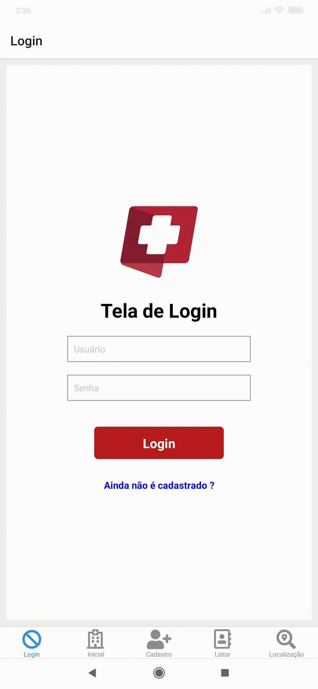

  
   

| Diretório | Descrição |
| ------ | ------ |
| [/app-clinica](https://github.com/FelipeGalvao1/projeto-clinica-app)|Dentro desse submodule está o versionamento do aplicativo usando React Native ; Você pode ver ele clicando [aqui](https://github.com/FelipeGalvao1/projeto-clinica-app)     |
| [/config](https://github.com/FelipeGalvao1/app-loja-php/tree/master/config) | Responsável por guarda o arquivo de configuração do projeto que faz comunicação com o banco de dados |
| [/db](https://github.com/FelipeGalvao1/app-loja-php/tree/master/db) | Scripts do banco de dados|
| [/domain](https://github.com/FelipeGalvao1/app-loja-php/tree/master/domain) | Responsável por guardar as funções do CRUD para cada tabela |
| [/service](https://github.com/FelipeGalvao1/app-loja-php/tree/master/service/) | Onde é guardado a parte de transformação de dados |
#

   

